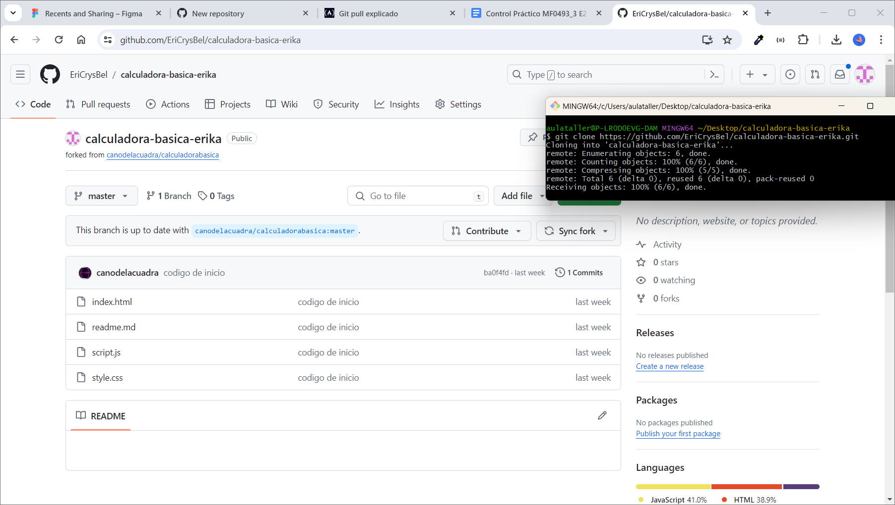

<!--  -->
# Tandem Notas

- Versión: 0.1
- Autor: Erika
- Licencia: MIT

## Índice
1. [Descripción general](#descripción-general)
2. [Instruccciones de instalación ](#instrucciones-de-instalación)
3. [Instrucciones de uso](#instrucciones-de-uso)
4. [Solución de los problemas](#solución-de-problemas)
5. [Información de contacto](#información-de-contacto)
8. [Apéndices](#apéndices)
9. [Tabla de software](#tabla-de-software)


## Descripción general
Esta aplicación tiene como intención realizar operaciones matemáticas básicas como una calculadora virtual.

## Objetivos
La aplicación realizará cálculos matemáticos de suma, resta, multiplicación y división.

## Tecnologías utilizadas: 


## Arquitectura del proyecto
Se compone por:
- Dos inputs tipo number para introducir los dos valores a operar. 
- Un selector desplegable con las operaciones de suma, resta, multiplicación y división.
- Un elemento que muestra el tipo de operación y resultado de la misma.


## Funcionalidades calculadora básica
- Suma: Se obtiene la suma de los dos números introducidos en pantalla.
- Resta: Se obtiene la diferencia entre los dos números introducidos en pantalla.
- Multiplicación: Se obtienen  los productos de los dos números introducidos en pantalla.
- División: Se muestra el cociente de los dos números introducidos en pantalla.

## Instrucciones de instalación
Realiza un "fork" de la siguiente url: [enlace a github](https://github.com/canodelacuadra/calculadorabasica.git) 


Con el nuevo repositorio realiza un git clone o en el shell.

```shell

git clone https://github.com/EriCrysBel/calculadora-basica-erika.git
```
Una vez descargado relaciona el repositorio y ejecutalo a través de un navegador.
```
https://localhost:3000/calculadora-basica-erika
```


## Instrucciones de uso
**Información básica:** 
   1. Introduce el primer número
   2. Introduce el segundo número
   3. Selecciona la operación que quieres realizar (suma, resta, multiplicación o división).
   4. Haz clic en "Calcular" para ver el resultado

**Ejemplos:** 
Ejemplos de cómo usar el proyecto o software para realizar tareas comunes.
Casos de uso: Casos de uso más avanzados del proyecto o software.

## Solución de problemas
- Error de división por cero: Si el usuario intenta dividir un número por cero, la aplicación arroja un error. 
Se valida la entrada del usuario para evitar divisiones por cero y se muestra un mensaje de error "No se puede dividir por cero".
- Problemas al realizar el redondeo: En operaciones que involucran números decimales, es posible que ocurran errores de redondeo, lo que podría afectar la precisión de los resultados. 
Se muestra un número adecuado de decimales en las operaciones internas y se redondea los resultados según sea necesario para mantener la precisión.

[erikacrystal95@gmail.com](emailto:erikacrystal95@gmail.com)

[Teléfono](tel:+34646729624)

[Documentación](https://docs.google.com/document/d/1ViiyzYsbwUaWqanK7lnnvs3tJgUnyQml/edit)


## Apéndices
Más información en nuestro gitgub:
[Erika](https://github.com/EriCrysBel/calculadora-basica-erika)


## Tabla de software
| Software  | Porcentaje |
| ------------- | ------------- |
| JavaScript  | 41%  |
| HTML5  | 38,9%  |
| Hoja de cálculo (css)  | 20,1%  |

